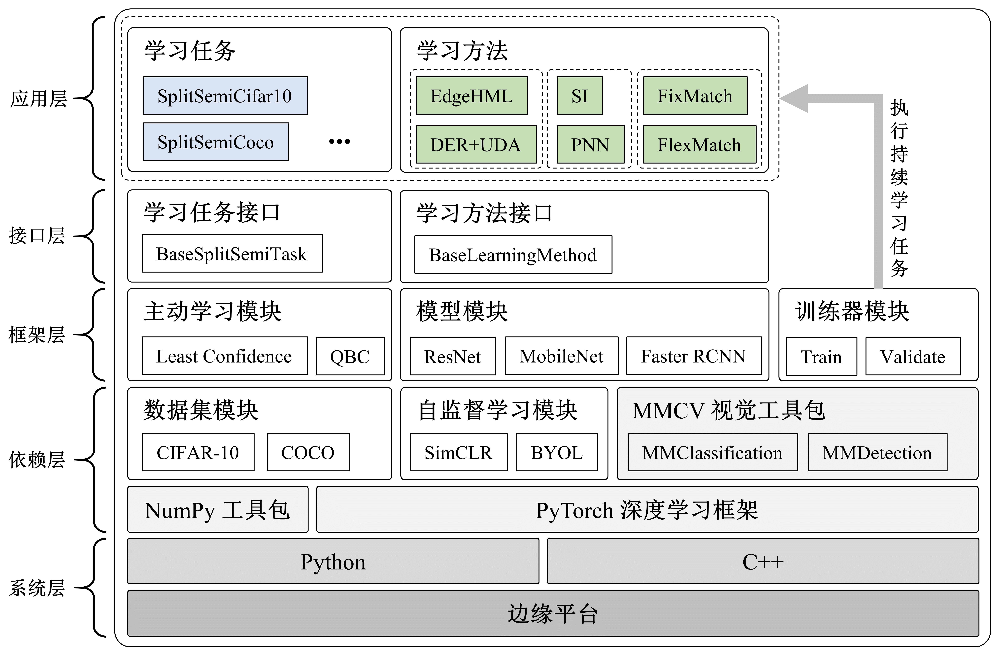
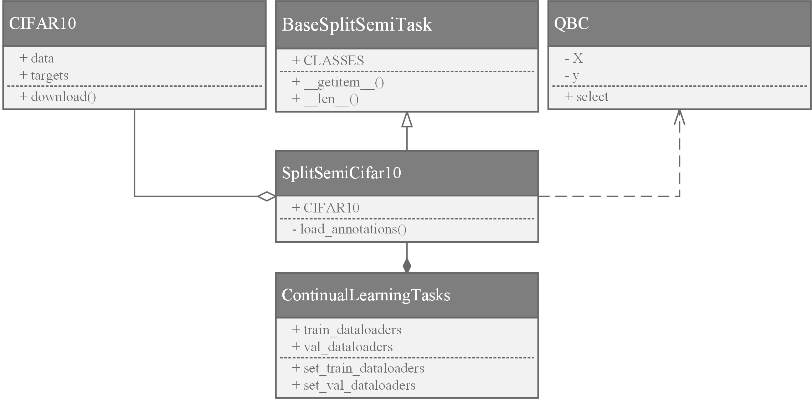
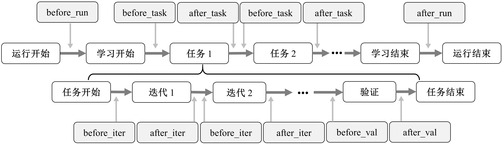
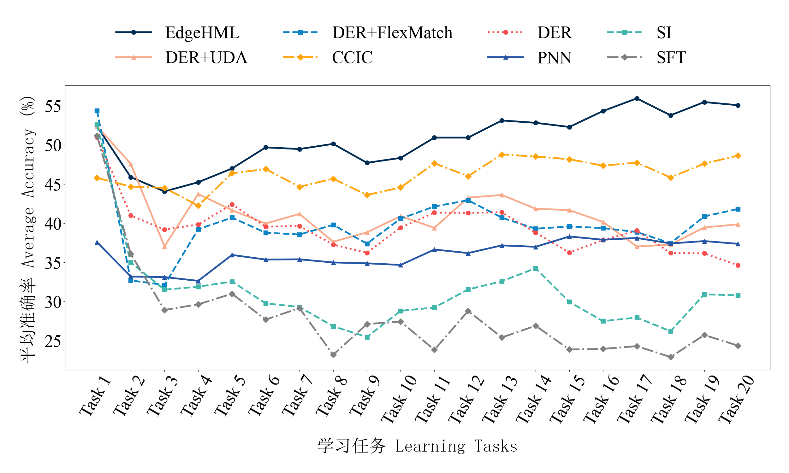
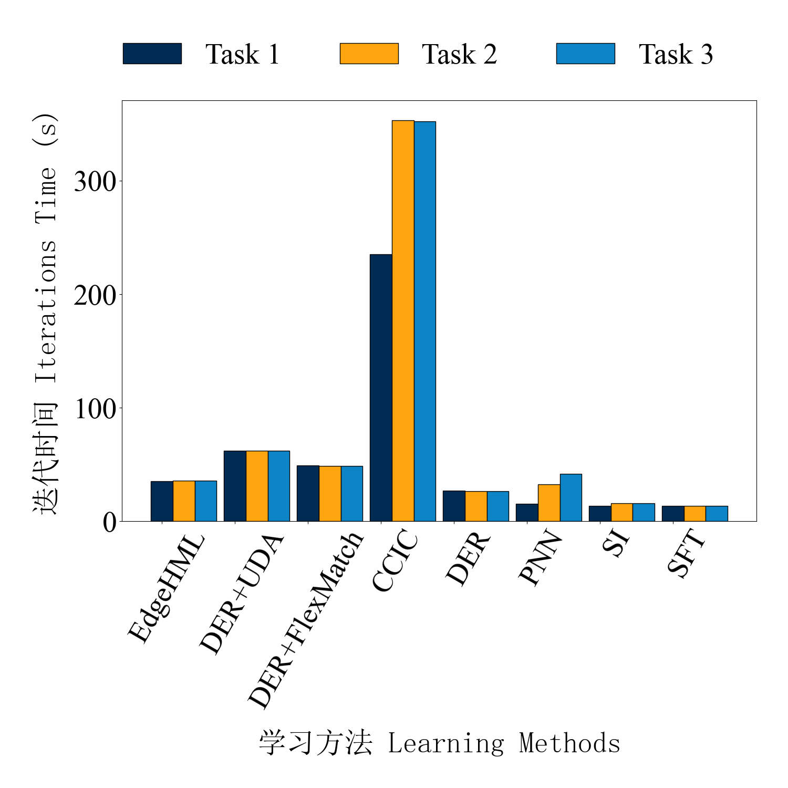

# EdgeHML


## 目录
- [1 介绍](#1-介绍)
    * [1.1 概述](#11-概述)
    * [1.2 框架结构](#12-框架结构)
- [2 开始](#2-开始)
    * [2.1 环境搭建](#21-环境搭建)
    * [2.2 使用方法](#22-使用方法)
    * [2.3 支持的方法&模型&数据集](#23-支持的方法模型数据集)
- [3 开发](#3-开发)
    * [3.1 实现新的学习任务](#31-实现新的学习任务)
    * [3.2 实现新的学习方法](#32-实现新的学习方法)
    * [3.3 生命周期钩子函数](#33-生命周期钩子函数)

## 1 介绍

### 1.1 概述

EdgeHML 是一个边缘侧半监督持续学习方法，旨在解决持续学习过程中面临的标注资源受限以及设备资源受限的问题。
通过构建层级化数据记忆池，对有监督资源和无监督资源进行分级保存与管理，并使用在线与离线相结合的策略来降低对无标注样本的维护开销，实现高效的数据回放，从而提升模型的可塑性与稳定性，帮助模型在学习新知识的同时，有效地复习以往的旧知识。为了更大程度地降低对于无标注样本的计算开销，EdgeHML 进一步采用了渐进式学习方法，通过细粒度地控制模型对于有标注样本和无标注样本的学习过程，有效降低了整体迭代时间。 [[arXiv](https://arxiv.org/abs/2303.11952)]

### 1.2 框架结构
EdgeHML（和其他一些持续学习方法）基于本项目中的半监督持续学习框架实现，该框架基于 [PyTorch](https://github.com/pytorch/pytorch) 以及 [MMCV](https://github.com/open-mmlab/mmcv) 系列工具包。



1. __系统层__。本项目基于边缘平台 NVIDIA Jetson Orin 模组（AGX Orin设备）以及服务器平台（RTX 8000）进行实现。安装了 Ubuntu 20.04 发行版，并搭建了 Python 语言环境，包括 Python 解释器以及常用的库。
2. __依赖层__。依赖层中最为核心的是 PyTorch 深度学习框架，该框架提供了具备 GPU 加速能力的张量计算以及具备自动梯度计算能力的深度神经网络。不同于常见的 Intel 和 AMD 架构的服务器，AGX Orin 设备无法通过 PyTorch 官方提供的安装方法（例如 pip）直接安装，而是需要下载 NVIDIA 特别提供的 PyTorch 二进制编译版本，并在配置好相应的链接库之后完成安装。此外，为了实现更为丰富的数据操作和计算机视觉处理操作，依赖层还包含了 [NumPy](https://github.com/numpy/numpy) 工具包以及 MMCV 系列工具包。
依赖层还提供了对数据集和自监督学习预训练权重的支持。其中，数据集模块包括常见的图像分类数据集（例如 CIFAR-10、CIFAR-100 以及TinyImageNet）、目标检测数据集（例如 COCO）等。这些数据集模块能够根据自定义配置对图像和标注数据进行加载，以支撑上层模块实现灵活的持续学习任务构建。
3. __框架层__。框架层主要包含模型模块以及训练器模块，同时提供了主动学习模块以针对不同数据集进行标注查询的操作。其中，模型模块能够基于 PyTorch 框架构建不同的深度神经网络，从轻量级的 MobileNet-v2 到较大规模的 ResNet-50 等。而主动学习模块提供了多种主动学习算法，以实现从无标注样本中挑选特定的样本进行标注。
训练器模块则是控制整个持续学习过程的核心，它的实现主要是在依赖层的基础上，针对持续学习场景构建了相应的流程和控制模式。具体而言，框架中的持续学习训练器基于迭代（Iteration）实现，以样本批的迭代为控制粒度，每一个任务的运行过程中包含多次迭代，每一次迭代内部又进一步包括样本批的分发、模型推理、损失值计算、反向传播、梯度下降等过程。而对于每个任务而言，在任务开始之前，需要处理相应的状态变量（例如学习进度、设备负载情况等），加载学习任务的数据，配置 DNN 模型，运行相应的生命周期钩子等；在任务执行过程中，需要测算相应的计算开销；在任务结束后，则需要进行 DNN 模型精度的评估以及记录，包括可塑性以及稳定性等方面，并继续执行额外的生命周期钩子。与此同时，为了支持一些上层学习方法以 Epoch 为粒度的操作，训练器会在 Iteration 的基础上，实现 Virtual Epoch，即在固定间隔的迭代次数之后注入模拟的 Epoch切换操作。
4. __接口层__。接口层主要基于框架层的模块向上提供学习任务和学习方法的实现接口，这一层将在 [3 开发](#3-development) 中具体阐述。
5. __应用层__。应用层主要基于底层依赖、框架以及接口层提供的能力实现不同的学习任务和学习方法。具体而言，学习任务指的是一系列具有不同领域或不同目标的（半监督）持续学习任务，例如，Split Semi CIFAR-10-5 任务就是由CIFAR-10 数据集构建的半监督持续学习任务，该任务将 CIFAR-10 的原始训练样本和验证样本按照类别平均划分为了 5 个（子）任务，每个任务包含不同的物体类别，因此 DNN 模型需要先后地在这 5 个任务上依次进行学习、评估，以模拟现实世界中外界环境变化的场景。以 Split Semi CIFAR-10-5 任务为代表的学习任务继承了接口层中的 `BaseSplitSemiTask` 类进行实现，通过依赖层中的 CIFAR-10 模块对原始的图像和标注进行读取，并随机选取每类别5个样本作为标注样本构建相应的持续学习任务。
而学习方法模块则是基于接口层中的 `BaseLearningMethod` 类进行实现。学习方法以持续学习方法为主，例如经典的持续学习方法 PNN、SI、DER 等，同时为了适应标注资源不足的情况，还包含了相应的半监督学习方法，例如 FixMatch、FlexMatch、UDA 等。在半监督持续学习任务中，我们可以将半监督学习与持续学习技术相结合，构建 DER+UDA、DER+FlexMatch 等具备有标注样本和无标注样本综合学习能力的持续学习方法。不同的方法可以根据需要构建额外的模块，例如 EdgeHML 方法实现了层级化数据记忆池来帮助 DNN 对以往任务的旧知识进行复习。

## 2 开始

### 2.1 环境搭建

> 下文提供了在 NVIDIA Jetson AGX Orin 设备上进行环境搭建的步骤，如果需要在其他边缘平台或服务器平台进行搭建，则可以直接修改相应的依赖项安装方式。

#### Requirements

* Python 3.8+
* CUDA 10.2+

#### Installation

0. Clone this repository
    ```bash
    git clone https://github.com/LINC-BIT/EdgeHML.git
    ```
1. Pytorch 1.10+
    请参考 NVIDIA 官方提供的 [Jetson 设备 PyTorch 安装教程](https://forums.developer.nvidia.com/t/pytorch-for-jetson/72048) 下载相应的 PyTorch 编译包并安装。
2. MMCV
    请参考 [MMClassification 的官方教程](https://github.com/open-mmlab/mmpretrain/tree/mmcls-0.x) 安装 MMCV 以及 MMClassification 工具包。
3. MMDetection（可选）
    请参考 [MMDetection 的官方教程](https://github.com/open-mmlab/mmdetection/tree/2.x) 安装 MMdetection 工具包。
    该工具包支持了本框架中对于目标检测任务的实现（例如半监督持续学习目标检测方法 SoftTeacher）
4. 其他依赖项
    ```bash
    pip install -r requirements.txt
    ```

### 2.2 使用方法

#### 运行命令

```bash
python src/train_cls_uni.py config_file --cfg-options key=value
```

其中，`config_file` 指定了运行的配置文件，该文件包含模型、数据集、训练配置等参数。与此同时，还可以使用 `--cfg-options` 可以直接在命令行中指定参数（覆盖配置文件中的对应项）。

#### 示例

在 Split Semi CIFAR-100-5 任务上使用 EdgeHML 执行半监督持续学习任务：

```bash
python src/train_cls_uni.py src/sscl/configs/image_classification/edgehml_cifar100/EdgehmlResnet18_HML200_b8_SeqSemiCifar100_task-il_1k.py
```

### 2.3 支持的方法&模型&数据集

以下是本框架中已经支持的方法（除 EdgeHML 以外）、模型以及数据集。

#### Methods
* 持续学习：
    * [PNN](https://arxiv.org/abs/1606.04671)
    * [SI](http://proceedings.mlr.press/v70/zenke17a)
    * [DER](https://proceedings.neurips.cc/paper/2020/hash/b704ea2c39778f07c617f6b7ce480e9e-Abstract.html)
    * [ER](https://arxiv.org/abs/1810.11910)
    * [oEWC](http://proceedings.mlr.press/v80/schwarz18a.html?ref=https://githubhelp.com)
    * [SoftTeacher](https://openaccess.thecvf.com/content/ICCV2021/html/Xu_End-to-End_Semi-Supervised_Object_Detection_With_Soft_Teacher_ICCV_2021_paper.html)
* 半监督学习：
    * [UDA](https://proceedings.neurips.cc/paper/2020/hash/44feb0096faa8326192570788b38c1d1-Abstract.html)
    * [FixMatch](https://proceedings.neurips.cc/paper/2020/hash/06964dce9addb1c5cb5d6e3d9838f733-Abstract.html)
    * [FlexMatch](https://proceedings.neurips.cc/paper/2021/hash/995693c15f439e3d189b06e89d145dd5-Abstract.html)
    * [MixMatch](https://proceedings.neurips.cc/paper/2019/hash/1cd138d0499a68f4bb72bee04bbec2d7-Abstract.html)
* 主动学习：
    * [Least Confidence, Margin, Entropy](https://minds.wisconsin.edu/handle/1793/60660)
    * [QBC](https://dl.acm.org/doi/abs/10.5555/645527.657478)

#### Models
* [ResNet](https://openaccess.thecvf.com/content_cvpr_2016/html/He_Deep_Residual_Learning_CVPR_2016_paper.html)
* [MobileNetV2](https://arxiv.org/abs/1801.04381)
* [ResNeXt](https://arxiv.org/abs/1611.05431)
* [InceptionV3](https://ieeexplore.ieee.org/document/7780677/)
* [RAN](https://doi.org/10.1109/CVPR.2017.683)
* [CBAM](https://doi.org/10.1007/978-3-030-01234-2_1)
* [SENet](https://ieeexplore.ieee.org/document/341010)
* [VGG](http://arxiv.org/abs/1409.1556)

#### Datasets
* [CIFAR-10, CIFAR-100](https://www.cs.toronto.edu/~kriz/cifar.html)
* [TinyImageNet](http://cs231n.stanford.edu/reports/2015/pdfs/yle_project.pdf)
* [COCO](https://cocodataset.org/#home)

## 3 开发

在系统结构中，接口层基于框架层提供的能力进行实现，向上层学习任务和学习方法等模块的构建提供支撑。具体而言，本框架作为一个通用型的持续学习框架，通过接口层提供了实现不同学习任务和不同学习方法的能力，在本节中，我们将以 CIFAR-10 数据集构建的半监督持续学习任务和 EdgeHML 学习方法为例，具体介绍如何进行接口开发。

### 3.1 实现新的学习任务



在整个持续学习过程中，包含一系列的任务（即 `ContinualLearningTasks` 类），每一个（子）任务（即 `SplitSemiCifar10` 类）都包含有少量的有标注样本和大量的无标注样本。这些样本中的图像和标注来自于底层的 CIFAR10 模块，并且可以调用主动学习方法（QBC 模块）选取特定的标注。`SplitSemiCifar10` 是构建学习任务的关键类，继承自 `BaseSplitSemiTask` 基类，该基类提供了半监督持续学习任务所需的共性接口，例如目标类别（`CLASSES`）、任务样本数量（`__len__`）以及样本获取（`__getitem__`）等。通过组合包含不同物体类别的多个学习任务，可以构建出完整的持续学习过程所需的一系列任务（即 `ContinualLearningTasks` 类），交由训练器模块使用相应的学习方法进行学习。

### 3.2 实现新的学习方法

实现半监督持续学习方法需要继承 `BaseLearningMethod` 这一基类，并通过设置类的属性 `ALG_NAME` 和 `ALG_COMPATIBILITY` 来指定当前方法的名称和兼容性（即支持何种持续学习场景设定）。学习方法的核心在于函数`forward_train`，该函数的输入为包含少量有标注样本和较多无标注样本的数据批，输出为 `DNN` 模型的损失值。如果新的学习方法需要在计算损失值之外完成一些更细粒度的操作，接口层也提供了相应的生命周期钩子函数予以支持。

### 3.3 生命周期钩子函数



整个系统从开始运行到结束运行经历了诸多的步骤，在每个步骤前后，可以通过重定义钩子函数来实现特定的操作。钩子函数遍布整个运行过程，覆盖了每个持续学习任务的生命周期：
1. 框架运行层面：在框架启动后、持续学习开始前提供了 `before_run`（钩子）函数，该函数可以用来实现学习方法内部状态的初始化、相关数据结构的创建等；在所有持续学习任务完成后、框架运行结束前提供了 `after_run` 函数，该函数可以用来实现日志记录、关闭文件等；
2. 任务层面：在每个任务的开始前提供了 `before_task` 函数，通过重定义该函数，不同的学习方法可以实现针对任务粒度的不同操作，例如基于结构扩展的持续学习方法可以进行新网络结构的创建和初始化；相应地，在每个任务后提供了 `after_task` 函数，该函数可以用来实现任务粒度的模型精度评估等；
3. 样本批迭代层面：对每个样本批进行迭代计算的前后，分别提供了 `before_iter` 和 `after_iter` 函数，这些函数可以用来实现迭代粒度的处理，例如基于正则化的持续学习方法可以基于这些函数实现对模型权重的记录和约束。
4. 其他层面：在完成每个任务的学习过程后，系统会对当前DNN模型的精度进行评估，即在所有历史任务和当前任务的验证数据上进行推理，记录预测结果的平均准确率。因此，在开始验证之前以及完成验证之后，分别提供了 `before_val` 和 `after_val` 函数，可供不同的学习方法为模型精度评估做准备，例如对于基于蒸馏技术的方法而言，可以切换教师模型和学生模型。

## 4 实验数据

基于半监督持续学习框架，我们对 EdgeHML 以及其他基准方法进行了对比，选取了平均准确率以及迭代时间两个指标来评估不同方法的模型精度以及计算开销。

在模型精度方面，EdgeHML 在 CIFAR-100 数据集构建的半监督持续学习任务上达到了 55.09% 的平均准确率，相比经典的持续学习方法最高提升了 24.29%，相比半监督持续学习方法在更低计算开销的条件下仍然达到了更高的准确率水平。


在计算开销方面，EdgeHML 凭借对有标注样本和无标注样本的分级管理，在保证模型精度的同时，相比现有的半监督持续学习方法最高缩短了 88.68% 的迭代时间，实现了边缘侧高性能、低开销的半监督持续学习过程。


## License

This project is released under the [Apache 2.0 license](LICENSE).